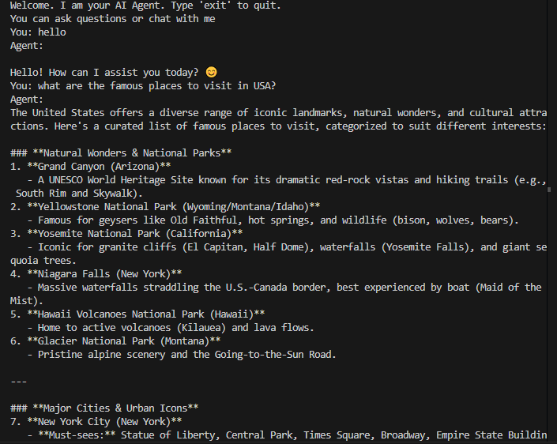

# Python AI Agent

This is a simple Python-based AI agent that interacts with users using OpenRouter's API. The agent takes user input, sends it to the OpenRouter API, and responds with the AI-generated output.

## Features
- Chat with an AI agent.
- Uses OpenRouter API for AI model integration.
- Easily configurable with environment variables.

## Prerequisites
- Python 3.8 or higher
- An OpenRouter API key

## Setup
1. Clone the repository:
   ```bash
   git clone <repository-url>
   ```
2. Navigate to the project directory:
   ```bash
   cd Python-AI-Agent
   ```
3. Install dependencies:
   ```bash
   pip install -r requirements.txt
   ```
4. Set up your `.env` file with your OpenRouter API key:
   ```env
   OPENROUTER_API_KEY=your_api_key_here
   ```

## Usage
Run the application using your preferred Python runner. For example:

Using `uv`:
```bash
uv run main.py
```

Using `python`:
```bash
python main.py
```

## Screenshot


## License
This project is licensed under the MIT License. See the LICENSE file for details.
